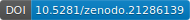

# SURF: Shoreline Uncertainty and Rate Framework

[](https://pypi.org/project/shoreline-surf/)
[](https://pypi.org/project/shoreline-surf/)
[](https://opensource.org/licenses/MIT)
[](https://doi.org/10.5281/zenodo.21286139)

**Citation:** Wernette, P. (2026) SURF: Shoreline Uncertainty and Rate Framework (v0.1.0). Zenodo. [](https://doi.org/10.5281/zenodo.21286139)

Shoreline change analysis that accounts for positional uncertainty, from a combination of:

> Wernette, P., A. Shortridge, D. Lusch, and A.F. Arbogast. (2017) Accounting for positional uncertainty in historical shoreline change analysis without ground-reference information. *International Journal of Remote Sensing*, 38(13), 3906-3922. [https://doi.org/10.1080/01431161.2016.1200728](https://doi.org/10.1080/01431161.2016.1200728)

> Wernette, P., J. Lehner, and C. Houser. (2020) What change is ‘real’? A probabilistic approach to accounting for uncertainty in environmental change analysis. *Geomorphology*, 355, 107083. [https://doi.org/10.1016/j.geomorph.2020.107083](https://doi.org/10.1016/j.geomorph.2020.107083)


**Figure 1:** A single composite walking through the whole Allegan, MI analysis end to end -- 1938 shoreline, 2010 shoreline, similarity index, critical change areas, probability-of-change line segments, and probability-of-change polygons.

## Table of Contents

- [What it does](#what-it-does)
- [Installation](#installation)
- [Standalone GUI](#standalone-gui)
- [Quickstart](#quickstart)
- [Probabilistic position / change-probability surfaces](#probabilistic-position--change-probability-surfaces)
- [Shoreline change-probability segments](#shoreline-change-probability-segments)
- [End Point Rate / Linear Regression Rate](#end-point-rate--linear-regression-rate)
- [Water-level lookup](#water-level-lookup-water-levels-subcommand)
- [Configuration](#configuration)
- [Testing](#testing)
- [Package layout](#package-layout)
- [Citation](#citation)
- [About](#about)

From the input shorelines and associated uncertainties, the probability of the shoreline position is first computed as a probability surface, then the change-probability is computed for each year pair, and finally the End Point Rate and Linear Regression Rate statistics are computed along a denser transect grid. The output similarity-index and significant-change rasters are then computed from the probability surfaces, and the change-probability and rate-of-change statistics are written to a CSV.

**SURF** (Shoreline Uncertainty and Rate Framework) is a complete, **arcpy-free**
reimplementation of the original ArcGIS Pro toolbox in
`original_program/arcgis_pro/`. It runs anywhere Python runs, with no ESRI
software required, using geopandas, shapely, pyproj, and rasterio (all
built on GDAL/OGR under the hood).

If you're migrating from the original ArcGIS scripts, see
[MIGRATION.md](MIGRATION.md) for a script-by-script mapping.

## What it does

Given two or more years of shoreline vector data for a site, the pipeline:

1. **Computes positional uncertainty** for each shoreline year from its RMSE
   components (base map error, georeferencing error, interpretation/digitizing
   error), following the NSSDA 95% radial accuracy standard (Eqs. 1-3 of the
   2017 paper) -- or accepts a precomputed RMSE95 value directly.
2. **Tests whether shoreline change is statistically significant** using the
   published Overlapping Double Buffer (ODB) method (Eq. 4): buffer each
   year's shoreline by its positional-uncertainty radius and compute the
   proportion of similarity, Ps = Area(intersection) / Area(union). Low Ps
   means the shorelines are distinguishable beyond their combined
   uncertainty -- real change. An unpublished/legacy iterative
   buffer-growth ("Perkal-style") alternative is also available, kept for
   side-by-side comparison.
3. **Measures the direction and magnitude of change** via shore-normal
   transects intersected with each year's shoreline.
4. **Compares independent ("professional") delineations** of the same
   shoreline, to characterize digitizing variability separately from real
   change.
5. **Produces true raster surfaces** (GeoTIFF) of Similarity_Index and
   Significant_Change across a site, in the spirit of the spatially-variable
   uncertainty concept from the companion paper, Wernette et al. (2020),
   "What is 'real'? Identifying erosion and deposition in context of
   spatially-variable uncertainty" (also included in this repo as a PDF).
6. **Computes continuous probability surfaces** (`epsilon_band_method:
   prob_change`, or `compute_prob_change: true` alongside any other
   method), a horizontal-direction analogue of that same 2020 paper's
   vertical DEM change-probability approach: a Gaussian position-probability
   surface per shoreline year, and a per-pixel and per-transect probability
   that the observed cross-shore change between two years is "real" rather
   than an artifact of positional uncertainty -- a continuous alternative to
   the binary significant/not-significant ODB/perkal test in step 2. See
   `surf/probability_surface.py` for the math.

Everything is driven by one YAML or JSON configuration file -- no site names,
years, or file paths are hardcoded, so the same pipeline runs on any number
of sites.

## Installation

**From PyPI** (recommended):

```bash
pip install shoreline-surf
```

**From source** (for development or the latest unreleased changes):

```bash
git clone https://github.com/pwernett/shoreline-surf.git
cd shoreline-surf
pip install -e .            # editable install
pip install -e ".[dev]"     # + pytest for running the test suite
```

Requires Python >= 3.9. Core dependencies: geopandas, shapely, pyproj,
rasterio, pyogrio, pandas, numpy, scipy, pyyaml, tqdm, requests.

## Standalone GUI

A tkinter-based graphical interface is included in `gui_app/`. It exposes every
option in the YAML config schema through a point-and-click form and can save and
load YAML files that are fully interchangeable with the CLI.

### Running from source

```bash
# 1. Install the package (if you haven't already)
pip install -e .

# 2. Launch the GUI
python -m gui_app
```

**Linux only** — tkinter is not always installed by default. Install it first:

```bash
# Debian / Ubuntu
sudo apt install python3-tk

# Fedora / RHEL / CentOS
sudo dnf install python3-tkinter
```

macOS (Homebrew Python) and Windows ship tkinter as part of the standard
library; no extra step is needed.

### Building a standalone executable

A single-file binary (no Python installation required on the target machine)
can be built with [PyInstaller](https://pyinstaller.org):

```bash
# 1. Install PyInstaller
pip install pyinstaller

# 2. From the repo root, run the build script
python gui_app/build_exe.py
```

The output lands in `dist_exe/SURF/` as a folder containing the
binary and all its dependencies:

| Platform | Launch with |
|---|---|
| Windows | `dist_exe\SURF\SURF.exe` |
| Linux | `dist_exe/SURF/SURF` |
| macOS | `dist_exe/SURF/SURF` |

Distribute the entire `dist_exe/SURF/` folder (zip it, or wrap
it with an installer like NSIS on Windows or AppImage on Linux).

To build the PyPI wheel separately (they go in `dist_pypi/` and don't conflict):

```bash
python -m build --outdir dist_pypi
twine upload dist_pypi/*
```

> **Why a folder and not a single file?** The geospatial stack (geopandas,
> rasterio, GDAL, pyproj) bundled from a conda environment easily exceeds 4 GB.
> PyInstaller's `--onefile` format uses a 32-bit integer for archive offsets and
> crashes above that limit. `--onedir` writes plain files and has no such
> constraint.

**Important:** PyInstaller always produces a binary for the platform it runs
on. To distribute for Windows, run the build script on a Windows machine (or
in a Windows CI runner); the script itself is identical on all platforms.

### GUI overview

The window has three tabs:

- **Settings** — output directory, target CRS, epsilon-band method (ODB /
  Perkal / Both), significance threshold, raster cell size, confidence levels,
  and toggles for `export_intersect_geometries`, `compute_prob_change`
  (+ segment length), and `compute_rate_of_change`.
- **Sites** — manage multiple sites from a list; for each site configure its
  name, transect spacing/length, and coordinate priority, then add/edit/remove
  shoreline years (year, shapefile path, optional RMSE95 override, optional
  acquisition date).
- **Log** — live output from the analysis run (dark terminal style); can be
  saved to a text file.

**File → Open YAML** and **File → Save YAML** round-trip to the same YAML
format used by the CLI, so any config built in the GUI can be run headlessly:

```bash
python -m surf.cli run --config my_config.yaml
```

## Quickstart

```bash
# 1. Generate a small synthetic dataset for the professionals/inter-analyst
#    demo (config_without_professionals.yaml needs no setup -- it ships
#    with real shoreline shapefiles, see below).
python examples/generate_synthetic_data.py

# 2. Run the pipeline against an example config -- three are provided:
#    one exercising the professional/inter-analyst comparison feature
#    (synthetic data), one without it (real historical data), and one
#    demonstrating the continuous prob_change probability surfaces (same
#    real historical data).
surf run --config examples/config_with_professionals.yaml --verbose
surf run --config examples/config_without_professionals.yaml --verbose
surf run --config examples/config_prob_change.yaml --verbose

# If you name your config file config.yaml (or config.yml) and run from its
# directory, --config can be omitted entirely:
#   cd my_project && surf run
```

Outputs are written under `<output_dir>/<site_name>/` (each example config
points at its own `output_dir`, e.g. `examples/output_with_professionals/`),
including:

- `odb_overlapping_buffer_table.csv` / `<site>_OVERLAPPING_BANDS.txt` -- ODB
  significance results per shoreline-year pair.
- `transects.shp`, `transect_intersections.csv`,
  `transect_distances_wide.csv` -- shore-normal transects and per-year
  intersection distances.
- `professional_comparison_*.csv` -- inter-analyst comparison tables (if
  `professionals` are configured).
- `similarity_index.tif`, `significant_change.tif` -- raster surfaces.
- `perkal_shoreline_buffer_table.csv`, `critical_areas_*` -- only if
  `epsilon_band_method` is `perkal` or `both`.
- `position_probability_density_<year>.tif`, `position_confidence_<year>.tif`
  (one pair per shoreline year), `position_delta_<a>_<b>.tif`,
  `change_probability_<a>_<b>.tif` (one pair per year pair), and
  `transect_change_probability.csv` -- written if `epsilon_band_method` is
  `prob_change`, OR if `compute_prob_change: true` is set (which works
  alongside `odb`/`perkal`/`both` too -- see [Probabilistic position /
  change-probability surfaces](#probabilistic-position--change-probability-surfaces)
  below).
- `change_probability_segments_<a>_vs_<b>.shp` / `_<b>_vs_<a>.shp` -- written
  alongside each `change_probability_<a>_<b>.tif` (so under the same
  `prob_change` conditions above): each shoreline in the pair broken into
  `prob_change_segment_length`-long pieces, each carrying a `PROB_CHANGE`
  attribute equal to that raster's mean value sampled along the segment, plus
  a `MAGNITUDE` attribute (negative = erosion, positive = accretion) --
  see [Shoreline change-probability segments](#shoreline-change-probability-segments)
  below.
- `rate_transects.shp`, `rate_transect_intersections.csv`,
  `transect_rate_of_change.csv`, `rate_change_polygons.shp` -- written if
  `compute_rate_of_change: true` is set (independent of everything else):
  End Point Rate and Linear Regression Rate change statistics along a
  separate, denser transect grid, plus polygons covering the area between
  each pair of adjacent rate transects -- see [End Point Rate / Linear
  Regression Rate](#end-point-rate--linear-regression-rate) below.

Every loop over sites, year pairs, transects, and buffer-pair geometries
shows a `tqdm` progress bar by default. Pass `--no-progress` to the CLI (or
`progress=False` to `run_pipeline`/`run_site` when calling the package
directly) to suppress them, e.g. for CI logs.

### Probabilistic position / change-probability surfaces

There are two ways to turn on the continuous probability surfaces (see
`examples/config_prob_change.yaml`), the horizontal-direction analogue of
the vertical DEM change-probability approach in Wernette et al. (2020),
"What is 'real'? Identifying erosion and deposition in context of
spatially-variable uncertainty" (included in this repo as a PDF). The math
lives in `surf/probability_surface.py`:

- `epsilon_band_method: prob_change` -- standalone shorthand: runs *only*
  the probability surfaces, swapping out the binary ODB/perkal significance
  test entirely (no `similarity_index.tif`/`significant_change.tif`).
- `compute_prob_change: true` -- independent flag: computes the probability
  surfaces *alongside* whatever `epsilon_band_method` (`odb`, `perkal`, or
  `both`) already produces, e.g. `epsilon_band_method: odb` +
  `compute_prob_change: true` writes both the ODB
  `similarity_index.tif`/`significant_change.tif` rasters AND the Gaussian
  position-probability/change-probability rasters from the same run.

- **Position-probability surface**, one per shoreline year: the Gaussian
  distribution N(0, sigma^2) describing that year's positional uncertainty,
  evaluated at every pixel's distance to the digitized line --
  `position_probability_density_<year>.tif` (true density) and
  `position_confidence_<year>.tif` (the same curve normalized to peak at
  1.0 on the line, easier to compare across years with different sigma).
- **Change-probability surface**, one per year pair: at every pixel, the
  signed cross-shore distance to each year's shoreline defines a Gaussian
  N(z, sigma^2); `change_probability_<a>_<b>.tif` is 1 minus the overlap
  area between the two years' Gaussians at that pixel (the Inman & Bradley
  1989 overlapping coefficient) -- the probability the observed offset,
  `position_delta_<a>_<b>.tif`, is real rather than an artifact of either
  year's positional uncertainty. `transect_change_probability.csv` is the
  same calculation applied to each transect's along-transect distances
  instead of a raster.

This is a continuous companion to, not a replacement for, the ODB
significance test: ODB gives one yes/no answer per shoreline pair, while
prob_change gives a 0-1 probability at every pixel and every transect,
useful for visualizing *where* a change is most/least certain rather than
just whether the site as a whole crossed a significance threshold.

### Shoreline change-probability segments

Whenever the change-probability surfaces above are computed, each
shoreline in a year pair is also written out broken into fixed-length
segments, each carrying its own summary of the same raster: one
`PROB_CHANGE` value per `prob_change_segment_length`-long piece of line,
rather than a continuous pixel surface. This reduces
`change_probability_<a>_<b>.tif` to something you can symbolize directly on
the shoreline itself (e.g. color each segment by how likely the change near
it is real) instead of needing to sample a raster underneath the line.

- `change_probability_segments_<a>_vs_<b>.shp` -- the `<a>`-year shoreline,
  segmented; `PROB_CHANGE` is the mean of `change_probability_<a>_<b>.tif`
  over the pixels each segment passes through.
- `change_probability_segments_<b>_vs_<a>.shp` -- the same, for the
  `<b>`-year shoreline.

Each segment also carries a `MAGNITUDE` attribute -- negative for erosion,
positive for accretion -- giving each segment a direction/amount of change
alongside its `PROB_CHANGE` likelihood. `MAGNITUDE` is *not* derived from the
`change_probability` raster itself (that raster's underlying signed-distance
calculation is a location-dependent baseline-side indicator, not a reliable
erosion/accretion sign); instead it's `TO_<b> - TO_<a>` (the same sign
convention as `EPR_NET_DISTANCE` below) read off the nearest general-purpose
transect to that segment's midpoint, via `transects.nearest_transect_net_distance`.

Controlled by `prob_change_segment_length` (default **50m**); see
`surf/probability_surface.py`'s `segment_line` and
`shoreline_change_probability_segments` for the implementation.

### End Point Rate / Linear Regression Rate

Independent of the ODB/perkal significance test and the prob_change
probability surfaces, `compute_rate_of_change: true` adds the standard
DSAS (Digital Shoreline Analysis System) -style shoreline change-rate
statistics, computed along a separate, denser transect grid (see each
site's `rate_transect_spacing`, default **1m** -- independent of
`transect_spacing`, which drives the general-purpose `transects.shp`/
`transect_distances_wide.csv` outputs). The math lives in
`surf/rate_of_change.py`.

- **EPR (End Point Rate)** -- uses only the oldest and youngest shoreline
  years at each transect: `EPR_NET_DISTANCE` is the raw along-transect
  distance between them, and `EPR_RATE` is that distance divided by the
  elapsed years (m/yr) -- the "average annual change" based on the
  end-point method.
- **LRR (Linear Regression Rate)** -- an ordinary-least-squares fit of
  along-transect distance vs. shoreline year, using every year available at
  that transect (needs >= 2): `LRR_RATE` (the slope, m/yr) is the "average
  annual change" based on the regression method; `LRR_NET_DISTANCE` is
  `LRR_RATE` scaled to the same elapsed-years magnitude as
  `EPR_NET_DISTANCE`, for direct comparison; `LRR_R2` is the regression's
  coefficient of determination. With exactly 2 shoreline years, LRR and EPR
  are numerically identical (`LRR_R2` is exactly 1.0, since a line through 2
  points is an exact fit) -- LRR only diverges from EPR once 3+ shoreline
  years exist for a site.

Both sets of statistics are appended to the same per-transect table:
`rate_transects.shp` (the transect grid itself, at `rate_transect_spacing`),
`rate_transect_intersections.csv` (long-format per-year intersection
distances, the input to the rate calculations), and
`transect_rate_of_change.csv` (the final wide table with
`EPR_NET_DISTANCE`/`EPR_RATE`/`LRR_NET_DISTANCE`/`LRR_RATE`/`LRR_R2`
columns alongside the existing per-year `TO_<year>` columns).

**Rate-change polygons.** `compute_rate_of_change: true` also writes
`rate_change_polygons.shp`: one polygon for the area between each pair of
sequentially-adjacent rate transects, per shoreline year pair, bounded by
the two transects' shoreline-intersection points in both years. Each polygon
carries:

- `TRANSECT_A`/`TRANSECT_B` -- the bounding transects' `TRANSECT_ID`s.
- `YEAR_A`/`YEAR_B` -- the shoreline year pair (`YEAR_A` < `YEAR_B`).
- `MAGNITUDE` -- mean of the two transects' `TO_<YEAR_B> - TO_<YEAR_A>`
  (negative = erosion, positive = accretion -- same sign convention as
  `EPR_NET_DISTANCE`).
- `RATE` -- `MAGNITUDE` divided by the elapsed years (m/yr; same convention
  as `EPR_RATE`).
- `PROB_CHANGE` -- the same Gaussian-overlap probability of "real" change
  (Wernette et al. 2020 Eqs. 2-3) used by the change-probability surfaces
  above, applied to the two transects' averaged positions for that year pair
  (truncated to `PROB_CHANG` in the shapefile's attribute table -- the ESRI
  Shapefile driver caps field names at 10 characters).

Transect pairs with a gap in the sequential `transect_id` (e.g. a transect
that never intersected a shoreline) are skipped, since that polygon would
span a discontinuity in the grid rather than a true adjacent gap. See
`build_rate_change_polygons` in `surf/rate_of_change.py`
for the implementation.

### Water-level lookup (`water-levels` subcommand)

Separate from the pipeline above (`run`), `water-levels` looks up the
observed water level at each shoreline's location and year/date via the
free, no-API-key [NOAA CO-OPS Tides & Currents
API](https://api.tidesandcurrents.noaa.gov) -- the one API that covers both
Great Lakes and marine/coastal stations:

```bash
python -m surf.cli water-levels --config examples/config_without_professionals.yaml
```

This walks every shoreline year in the config, finds the nearest CO-OPS
station to that shoreline (by reprojecting its geometry's centroid to
lat/lon and searching the full station list), and looks up:

- **An annual mean** (`monthly_mean`, averaged across the year), if the
  shoreline year has no `acquisition_date` set -- useful for climate-style
  context ("was this a high or low water year").
- **A date-specific level** (`hourly_height` for marine stations,
  `daily_mean` for Great Lakes stations, both forced to local standard
  time), centered on `acquisition_date` if that's set on the shoreline year
  -- the water/tide stage at the moment the shoreline was actually
  digitized, which is a real source of horizontal shoreline-position error
  distinct from the RMSE components above. If the requested day has no data
  (common for older imagery, or a station outage), the window is widened
  (`--window-days`, doubling up to a cap) until data is found; any widening
  used is recorded in the output's `fallback_used` column rather than being
  silently absorbed.

Results are written to one CSV (`<output_dir>/water_levels.csv` by default,
or `--out`), one row per shoreline year, with the matched station, datum
(`IGLD` for Great Lakes, `MSL` for marine, unless overridden with
`--datum`), the looked-up value, and an `error` column for any shoreline
that couldn't be resolved (no nearby station, no data for that period,
etc.) -- a failure on one shoreline never aborts the whole run.

This subcommand makes live network calls and is the one part of this
package that does -- the `run` pipeline and its 135+ tests stay
offline/deterministic by design (see `surf/water_level.py`
for the full rationale). It's also intentionally **not** folded into
`uncertainty.py`'s RMSE_O automatically: the three Wernette et al. (2017)
RMSE components (base map, georeferencing, interpretation) don't include a
water-level/tidal-datum term, and combining a *measured* water level with
that *modeled* equation is a decision left to you, made explicitly with this
CSV in hand -- not something done silently inside the pipeline.

## Configuration

Three fully annotated example configs are provided:

- [examples/config_with_professionals.yaml](examples/config_with_professionals.yaml)
  -- includes a `professionals` block (inter-analyst comparison enabled),
  backed by the synthetic dataset from `generate_synthetic_data.py`.
- [examples/config_without_professionals.yaml](examples/config_without_professionals.yaml)
  -- no `professionals` block, for sites where you only have one analyst's
  delineations. Backed by **real historical shoreline data**: 1938 and 2010
  shapefiles for the Allegan, MI site (one of the four original study sites
  in Wernette et al. 2017), shipped in `examples/data/allegan/`. Each
  shapefile already carries a precomputed `UNCERTAINT` attribute, used
  directly as `rmse95_override`, so no RMSE component calculation is needed
  for this example.
- [examples/config_prob_change.yaml](examples/config_prob_change.yaml) --
  the same real Allegan data as above, with `epsilon_band_method:
  prob_change` instead of `odb`, demonstrating the continuous probability
  surfaces described above (and documenting the `compute_prob_change`
  alternative for combining them with `odb`/`perkal`/`both`). Also enables
  `compute_rate_of_change` and a custom `prob_change_segment_length`, so it
  doubles as the example for [Shoreline change-probability
  segments](#shoreline-change-probability-segments) and [End Point Rate /
  Linear Regression Rate](#end-point-rate--linear-regression-rate).

To run against your own data, copy whichever one matches your situation and
point each `shorelines[].path` (and, optionally, `professionals[].path`)
entry at your real shapefiles -- no code changes are needed. Key options:

- `sites` -- one entry per site, each with its own `shorelines` (>= 2 years
  required), optional `baseline` (a line shapefile; auto-detected via PCA if
  omitted), `transect_spacing`/`transect_length`, `coordinate_priority`
  (`UPPER_LEFT`/`UPPER_RIGHT`/`LOWER_LEFT`/`LOWER_RIGHT`, controlling the
  sign/direction of along-transect distance), and optional `professionals`
  (omit this list entirely if you have nothing to compare against).
- `epsilon_band_method` -- `odb` (published, recommended), `perkal`
  (legacy/unpublished), `both`, or `prob_change` (continuous probability
  surfaces only, nothing else -- see [Probabilistic position /
  change-probability surfaces](#probabilistic-position--change-probability-surfaces)
  above).
- `compute_prob_change` -- `true`/`false` (default `false`). Independent of
  `epsilon_band_method`: set this alongside `odb`/`perkal`/`both` to get the
  probability surfaces *in addition to* that method's outputs, rather than
  instead of them. See [Probabilistic position / change-probability
  surfaces](#probabilistic-position--change-probability-surfaces) above.
- `prob_change_segment_length` -- segment length (site CRS units, usually
  meters; default **50m**) for the `change_probability_segments_*.shp`
  outputs. Only used when prob_change surfaces are computed. See [Shoreline
  change-probability segments](#shoreline-change-probability-segments)
  above.
- `compute_rate_of_change` -- `true`/`false` (default `false`). Independent
  of everything else: computes End Point Rate and Linear Regression Rate
  shoreline change statistics along a separate, denser transect grid. See
  [End Point Rate / Linear Regression
  Rate](#end-point-rate--linear-regression-rate) above. Each site can also
  set `rate_transect_spacing` (default **1m**) to control that grid's
  density independently of `transect_spacing`.
- `significance_threshold` -- T in Eq. 4; Ps below this is significant change.
- `confidence_levels` -- used by the perkal method and critical-area export.
- `target_crs` -- force a common projected CRS, or leave unset (`null`) to
  auto-detect a UTM zone per site. Accepts an `"EPSG:xxxx"` string, a bare
  EPSG integer (e.g. `32616`), or any other CRS representation
  `pyproj.CRS.from_user_input()` understands (WKT, PROJ4, etc.).
- `raster_cell_size` -- grid cell size (site CRS units, usually meters) for
  the output rasters. Defaults to **0.5m** if omitted.

Each shoreline year can also set `acquisition_date` (`"YYYY-MM-DD"`), the
real day it was digitized -- unused by the `run` pipeline, but read by the
`water-levels` subcommand to do a date-specific rather than annual
water-level lookup for that year. See [Water-level
lookup](#water-level-lookup-water-levels-subcommand) above.

Each shoreline year needs *either* `rmse95_override` (a precomputed 95%
positional-uncertainty radius) *or* an `uncertainty` block with `rmse_base`,
`rmse_georef`, and either `rmse_interp` or raw `interp_distances`.
`interp_distances` are the raw per-point digitizing/interpretation-error
offsets `d` -- e.g. the distance between vertices from repeat digitizing of
the same shoreline, or between the analyst's line and a higher-accuracy
reference shoreline -- used to compute `RMSE_I = sqrt(sum(d^2) / n)` (Eq. 1),
the interpretation-error component of the overall positional uncertainty.
Pass `rmse_interp` instead if you've already computed that RMSE value.

## Testing

```bash
pytest
```

The test suite (`tests/`) uses synthetic, geometrically-known shorelines
generated on the fly (see `tests/conftest.py`); it does not depend on the
real Allegan shapefiles bundled under `examples/data/allegan/` for the
`config_without_professionals.yaml` example. Real data can be substituted at
any time by pointing a config's `path` fields at new files; nothing else
changes.

## Package layout

```
surf/
  config.py               run/site configuration (dataclasses + YAML/JSON loader)
  uncertainty.py           RMSE / positional-uncertainty calculations (Eqs. 1-3)
  epsilon_bands.py         ODB (Eq. 4) + legacy Perkal-style significance testing
  transects.py              baseline + shore-normal transect generation/intersection
  critical_areas.py        critical-area export for the Perkal method
  comparison.py             professional/inter-analyst comparison
  raster_output.py         GeoTIFF similarity-index / significant-change surfaces
  probability_surface.py   Gaussian position/change-probability surfaces (prob_change)
  rate_of_change.py         EPR / LRR shoreline change-rate statistics (compute_rate_of_change)
  water_level.py             NOAA CO-OPS water-level lookup (water-levels subcommand)
  io_utils.py               shapefile I/O, reprojection, CSV/log writers
  geometry_utils.py        shared vertex-distance helpers
  pipeline.py                per-site and full-run orchestration
  cli.py                     command-line entry point

gui_app/
  __init__.py              package marker
  __main__.py              entry point: python -m gui_app
  app.py                   main tkinter application (Settings / Sites / Log tabs)
  build_exe.py             PyInstaller build script → dist/SURF(.exe)
```

`original_program/arcgis_pro/` is left untouched as a historical reference;
it requires ArcGIS Pro (arcpy) and is not used by anything in this package.

## Citation

If you use this code in your research, please cite it as:

**APA:**
Wernette, P. (2026) SURF: Shoreline Uncertainty and Rate Framework (v0.1.0). Zenodo. https://doi.org/10.5281/zenodo.21286139

**BibTeX:**
```bibtex
@software{wernette2026surf,
  author    = {Wernette, Phillipe},
  title     = {{SURF}: {S}horeline {U}ncertainty and {R}ate {F}ramework},
  year      = {2026},
  version   = {0.1.0},
  doi       = {10.5281/zenodo.21286139},
  publisher = {Zenodo},
  url       = {https://github.com/pwernett/shoreline-surf}
}
```

**MLA:**
Wernette, P. "SURF: Shoreline Uncertainty and Rate Framework." Zenodo, 2026, https://doi.org/10.5281/zenodo.21286139

Please also cite the original research papers on which this code is based:

> Wernette, P., A. Shortridge, D. Lusch, and A.F. Arbogast. (2017) Accounting for positional uncertainty in historical shoreline change analysis without ground-reference information. *International Journal of Remote Sensing*, 38(13), 3906-3922. [https://doi.org/10.1080/01431161.2017.1303218](https://doi.org/10.1080/01431161.2017.1303218)

> Wernette, P., J. Lehner, and C. Houser. (2020) What change is 'real'? A probabilistic approach to accounting for uncertainty in environmental change analysis. *Geomorphology*, 355, 107083. [https://doi.org/10.1016/j.geomorph.2020.107083](https://doi.org/10.1016/j.geomorph.2020.107083)

## About

The project is part of a broader collaboration to better understand landscape change and morphodynamic processes.

For questions related to this project, please contact:

Phillipe Wernette, PhD [pwernett@msu.edu]()
