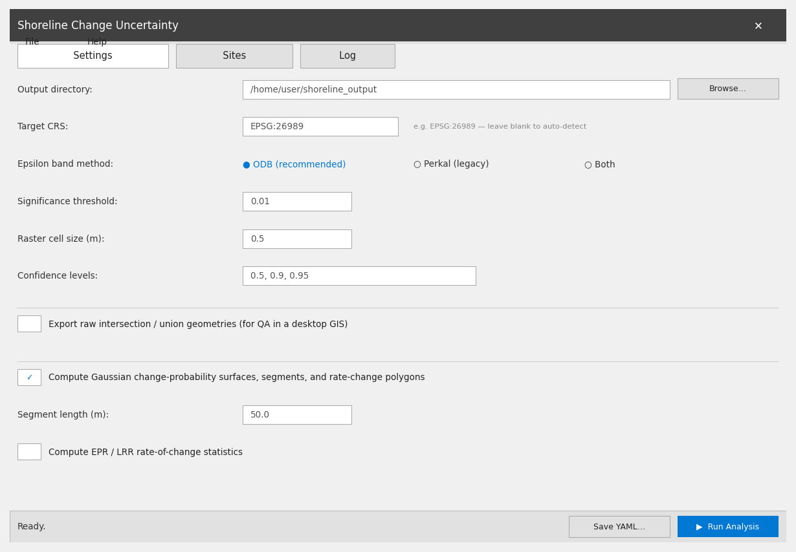
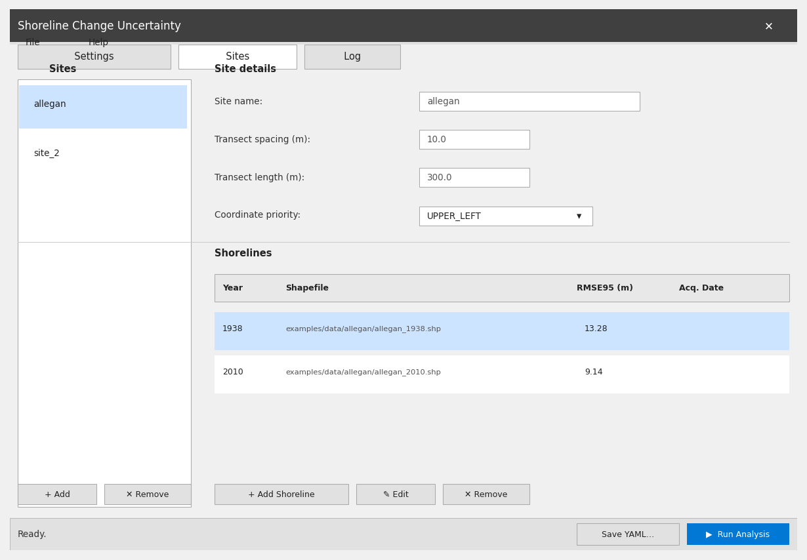
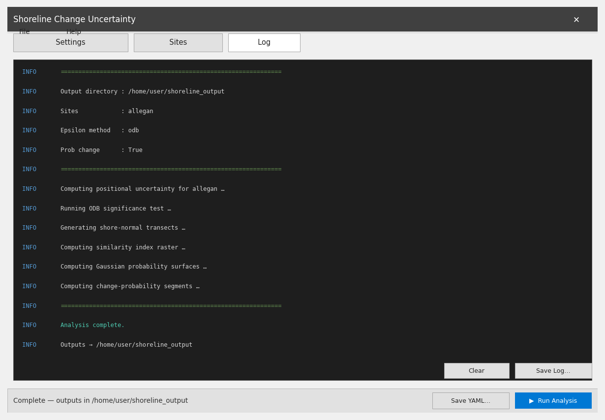

# Shoreline Change Uncertainty — Standalone GUI

A self-contained desktop application built from the same Python code as the
`shoreline-uncertainty` CLI, with no ArcPy or QGIS dependency.

---

## Screenshots

### Settings tab

Configure output directory, coordinate reference system, epsilon-band method,
significance threshold, raster cell size, confidence levels, and optional
outputs (probability surfaces, rate-of-change statistics).



### Sites tab

Add one or more named sites, set transect parameters, and attach shoreline
shapefiles with their RMSE95 positional-uncertainty values and optional
acquisition dates.



### Log tab

Live scrolling log with colour-coded INFO / WARNING / ERROR messages.  Save
the full log to a text file or clear it between runs.



---

## Requirements

| Platform | Requirement |
|----------|-------------|
| Windows  | Nothing extra — tkinter is bundled with CPython |
| macOS    | Nothing extra — tkinter is bundled with CPython |
| Linux    | `sudo apt install python3-tk` (Debian/Ubuntu) |

---

## Running from source

```bash
# From the repository root
pip install -e ".[dev]"          # install the analysis package in editable mode
python -m gui_app                # launch the GUI
# or via the CLI entry point:
shoreline-uncertainty gui
```

---

## Building a standalone executable

The `build_exe.py` script uses [PyInstaller](https://pyinstaller.org) to
produce a self-contained folder that can be zipped and distributed without a
Python installation.

```bash
# From the repository root
pip install pyinstaller
python gui_app/build_exe.py
```

Output lands in `dist_exe/ShorelineUncertainty/`.

| Platform | Launch command |
|----------|----------------|
| Windows  | `dist_exe\ShorelineUncertainty\ShorelineUncertainty.exe` |
| Linux    | `dist_exe/ShorelineUncertainty/ShorelineUncertainty` |
| macOS    | `dist_exe/ShorelineUncertainty/ShorelineUncertainty` |

Distribute the entire `dist_exe/ShorelineUncertainty/` folder (zip it up, or
wrap it with an installer such as NSIS on Windows or AppImage on Linux).

> **OneDrive / cloud-sync note:** the build script writes all intermediate and
> output files to a system temp directory first, then copies the finished
> folder back.  This prevents OneDrive from locking build files mid-run.

---

## YAML interoperability

The GUI reads and writes the same YAML config files used by the CLI:

```bash
# Round-trip: open in GUI, tweak, save, then run headlessly
shoreline-uncertainty run --config my_config.yaml
```

File → Open YAML… loads an existing config into the form fields.  
File → Save YAML… (or the **Save YAML…** button in the status bar) exports
the current form state back to a config file.
